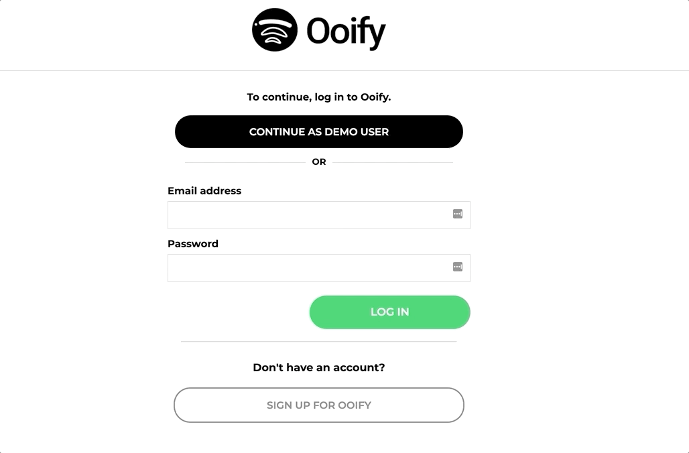

# README

<h1>Ooify</h1>

Ooify is a single-page-application clone of Ooify. It allows users to sign up for an account, listen to music and organize that music using personal playlists.

<h2>Technologies</h2>
Ruby on Rails
PostGreSQL
React
Redux

<h2>
    <a href="https://ooify.herokuapp.com">
        Ooify App
    </a>
</h2>

<h2>Features</h2>
<ul>
    <li>
        User Authentication
        <ul>
            <li>
                Sign Up
            </li>
            <li>
                Login
            </li>
            <li>
                Logout
            </li>
        </ul>
    </li>
    <li>
        Album Index Display
    </li>
    <li>
        Album Show Page
        <ul>
            <li>
                Look at songs that belong to an album and add those songs to a personal playlist.
            </li>
        </ul>
    </li>
    <li>
        Playlist CRUD
        <ul>
            <li>
                Make a Playlist
            </li>
            <li>
                Delete a Playlist
            </li>
            <li>
                Add/Delete Songs from a playlist
            </li>
        </ul>
    </li>
    <li>
        Continuous Play
        <ul>
            <li>
                Ability to play songs and navigate to different pages.
            </li>
        </ul>
    </li>
</ul>

<h2>Splash Page</h2>
When the user is navigated to the splash page it allows them to login to their account, 
or if they don't have an account yet allows them to make one with the login and signup links at the top.

<h2>Sign Up</h2>
After the user has seen the splash page they will be able to signup for an account on Ooify. The application
will then check to make sure that the data inserted for signup is valid and then make the account if it is.

 
 

 
 

<h2>Login</h2>
If the user has already signed up they will be able to login into their account when visiting the site. This page
will verify the users credentials with our database.

 
 

 
 

<h2>Album Index</h2>
When a user first logs in they will be greeted by a bunch of different features off the bat.
The first noteable one is the Album index page. It has a list of albums that the user is able to select from
in order to start listening to music/adding music to their personal playlists.

 
 

 
 

<h2>Album Show</h2>
In the album show page a user can can select and play songs from this album. 
They can also add songs from this album to a personal playlist.

 
 

 
 

<h2>Artist Show</h2>
The artist show page can be reached from anywhere there is a song. The artist show page
will have a cover photo of the artist as well as all the albums that the artist has in our
database. Clicking on the individual albums will lead back to the album show page.

 
 

 
 

<h2>Playlist CRUD</h2>
Playlist CRUD is an essential part of the Ooify application and is available from anywhere in the app.
The ever persisting nav bar on the side has a create playlist button that allows users to create playlists,
as well as navigate to the pages where they already have playlists.
A user also has in each playlists show page the ability to delete the playlist.
Also in each album show page as well as each playlist show page each individual song item can be added to a playlist.

 
 

 
 

 
 

 
 

 
 

 
 

<h2>Continous Play</h2>
The play bar at the bottom has the ability to continuosly play music regardless of which page it is on or navigates to.
Also the songs can be paused once they have been played.

 
 

 
 

